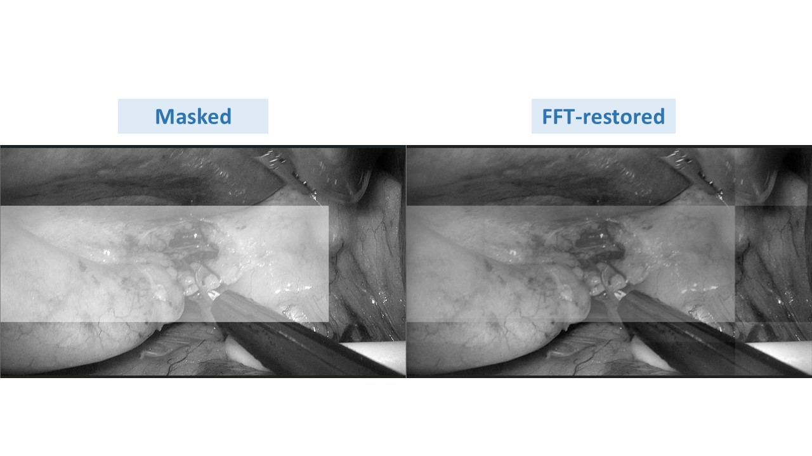

# Fast_Fourier_Transformation_Image_Restoration
This project represents a small-scale investigation into the effectiveness of Fast Fourier Transform (FFT) in restoring masked images. 

The loss function employed in the convolutional neural network (CNN) model combines Structural Similarity Index (SSIM) and L1 loss.
## The Final result of FFT image restoration

## Visualization of FFT transformation and restoration

